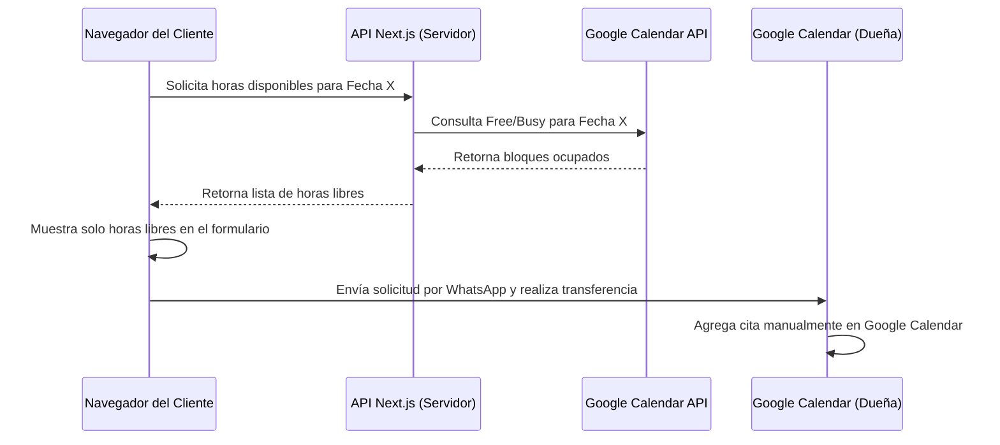

# Plan de Finalización - GM NailArtist

Este plan detalla los pasos técnicos y el cronograma para completar el sitio web de **GM NailArtist**, integrar la disponibilidad de Google Calendar en tiempo real, optimizar el SEO/GEO local, y preparar el entregable para el cliente.

---

## 1. Hito 1: Optimización de SEO Local & GEO (Santiago, Ñuñoa)

Para asegurar que la clientela local encuentre a GM NailArtist en Google, implementaremos mejoras de SEO y posicionamiento geográfico:

- **Estructuración de Metadatos Canónicos**: Configurar la URL final de producción (`https://gmnailartist.cl` o la que decida el cliente) en `app/layout.tsx` y generar etiquetas canónicas dinámicas.
- **Esquema de Negocio Local (LocalBusiness JSON-LD)**: Enriquecer el script de `schema.org` existente en `app/layout.tsx` para incluir:
  - Coordenadas geográficas exactas (latitud y longitud) de la Sede Ñuñoa.
  - Dirección física completa (Calle, Número, Comuna, Santiago, Chile).
  - Enlaces oficiales de redes sociales y número de contacto formateado internacionalmente.
- **Optimización de Imágenes de la Galería**: Asegurar que todas las imágenes en `public/images/` tengan atributos `alt` optimizados con palabras clave locales (ej. "Manicure permanente en Ñuñoa", "Diseño de uñas a mano alzada Santiago").

---

## 2. Hito 2: Integración de Disponibilidad de Google Calendar (Tiempo Real)

Implementaremos la lectura de disponibilidad en tiempo real para evitar reservas duplicadas, manteniendo el control de pagos manual en WhatsApp:

### Arquitectura de Conexión

### Pasos de Implementación
1. **Ruta de API Segura (`/api/calendar/availability`)**:
   - Crear una ruta en Next.js para consultar el estado `freebusy` de Google Calendar.
   - Usar credenciales seguras (Service Account) guardadas en variables de entorno (`.env.local`) para no exponer datos sensibles en el cliente.
2. **Actualización de `BookingModal.tsx`**:
   - Al seleccionar una fecha, hacer una petición `fetch` a nuestra API.
   - Reemplazar la lista estática de horas (`TIME_SLOTS`) por los horarios reales libres devueltos por la API.
3. **Página de Configuración**:
   - Proveer instrucciones claras para que la dueña comparta su calendario de Google con la cuenta de servicio del proyecto.

---

## 3. Hito 3: Handoff & Entrega al Cliente

Preparación de la entrega del proyecto de forma profesional:
- **Guía de Entrega (`handover_guide.md`)**: Un documento detallado con instrucciones paso a paso para la dueña sobre cómo gestionar el sitio, actualizar tarifas y usar el Google Calendar.
- **Configuración de Vercel**: Configurar las variables de entorno de producción (`GOOGLE_CLIENT_EMAIL`, `GOOGLE_PRIVATE_KEY`, `GOOGLE_CALENDAR_ID`) en la consola de Vercel.
- **Paso a Producción**: Despliegue final con dominio propio si el cliente lo prefiere.

---

## Plan de Verificación

### Pruebas Automatizadas e Integración
- Validar las respuestas de la API de disponibilidad de Google Calendar con diferentes zonas horarias y eventos ocupados.
- Testear el rendimiento de carga y SEO en dispositivos móviles usando Lighthouse.

### Pruebas Manuales
- Agendar una hora ocupada directamente en Google Calendar y verificar que desaparece de las opciones en la web en menos de 2 segundos.
- Probar el flujo completo de reserva desde móviles.
